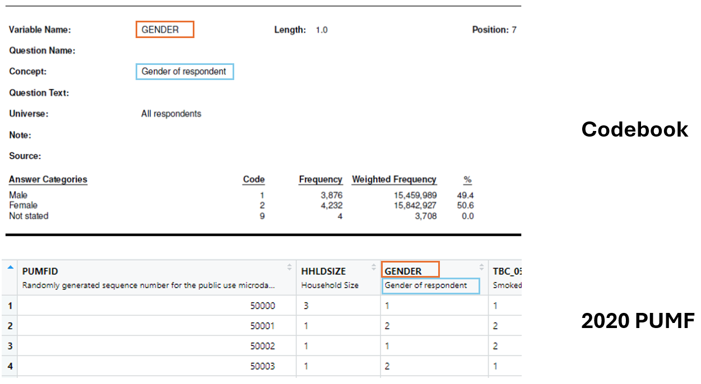

# Getting ready to analyze microdata

**Please note that we are aiming to demonstrate the capacity of R to analyze microdata, not teach new users how to use R. For beginner R help, please take those workshops offered by the library or book a consult with the GAA.**

## Set the working directory

The default working directory for an RMarkdown file is the location of the file (e.g. your "Downloads" folder if you just downloaded and opened it). To save workshop files to a different location, in RStudio go to *File -\> Save As -\>* and choose a location you will remember.

## Install and load required packages

```r

required_packages <- c("haven", "dplyr", "srvyr", "gtsummary", "ggplot2", "ggpubr")

# Loop through each required package and install any that are missing
for (package in required_packages) {
    if (!package %in% installed.packages()) {
        install.packages(package)
    }
}

#Load required packages for use in this R session (HIDE OUTPUT)
library(haven)     #to import SPSS .sav file 
library(dplyr)     #for data manipulation
library(srvyr)     #survey-specific functions
library(gtsummary) #create summary tables
library(ggplot2)   #create plots
library(flextable) # create tables 
library(officer)   # manipulate word docs and power points


```

## Download and unzip the microdata

This workshop uses Public Use Microdata Files (PUMFs) from the *Canadian Tobacco and Nicotine Survey* (CTNS). PUMFs for the CTNS and other Statistics Canada surveys are available in Abacus, UBC Library's data repository (<https://abacus.library.ubc.ca/>).

Survey data can be downloaded by visiting Abacus with a browser, but R can automate the process using the Abacus API. Each Abacus file has a persistent identifier called a *handle*. Listed below are the CTNS data files used in this example. (Links are to the Abacus records where you'll also find codebooks and user guides.)

| Survey                                                 | File description              | File name                   | Handle                    |
|-------------------|------------------|------------------|------------------|
| [CTNS 2020](https://hdl.handle.net/11272.1/AB2/UYC0Z8) | Microdata in SPSS .sav format | CTNS_2020_PUMF_SPSS_sav.zip | 11272.1/AB2/UYC0Z8/XVITQW |
| [CTNS 2022](https://hdl.handle.net/11272.1/AB2/PWWFK3) | Microdata in SPSS .sav format | CTNS_2022_SPSS_SAV.zip      | 11272.1/AB2/PWWFK3/4K96XZ |

Run the code below to download and unzip data files for the 2020 and 2022 survey years

```r

download.file("https://abacus.library.ubc.ca/api/access/datafile/:persistentId?persistentId=hdl:11272.1/AB2/UYC0Z8/XVITQW","CTNS_2020.zip", mode="wb")

download.file("https://abacus.library.ubc.ca/api/access/datafile/:persistentId?persistentId=hdl:11272.1/AB2/PWWFK3/4K96XZ","CTNS_2022.zip", mode="wb")

unzip("CTNS_2020.zip")
unzip("CTNS_2022.zip")

```

Look in the RStudio *Files* tab in the bottom right of the screen. You should see the unzipped ".sav" files in your working directory.

## Read in your sav files

The *read_sav* function from the *haven* package imports SPSS .sav files as *data.frames*, which are similar to spreadsheets. It also imports variable and value labels to make the data easier to work with.

```r

#Import the .sav files and store them as 'ctns2020' and 'ctns2022'
data2020 <- read_sav("ctns_2020_pumf_eng.sav")
data2022 <- read_sav("ctns_2022_pumf.sav")

```

It is important to check that your data imported correctly. Click 'data2020' and 'data2022' in the environment pane (top right) to view the imported data. Is it what you expect?

### Why use sav files?

If we compare the codebook to the data imported into R as a sav file, we can see that the codebook variables have a description directly in the header of the dataframe. If we were using a plain text format, we would loose this information.


