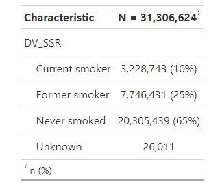
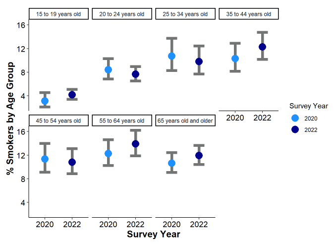

# Example of data analysis in R

Follow along and run the code in this <a href= "https://ubc-library-rc.github.io/r-microdata/content/r_microdata_outline.Rmd" target="_blank">R Markdown file</a>.

Refer to <a href="https://ubc-library-rc.github.io/r-microdata/content/r_microdata_outline.pdf" target="_blank">this PDF</a> for the full output of the R Markdown file above.

# New R topics covered at this point in the workshop
## Summary tables

## Plots in <a href="https://ubc-library-rc.github.io/ggplot2_intro_workshop/" target="_blank">ggplot2</a>

# Practice examples 
Download this <a href="https://ubc-library-rc.github.io/r-microdata/content/r_microdata_practice.Rmd" target="_blank">R Markdown file</a> to practice the R skills demonstrated in the workshop (optional). 
